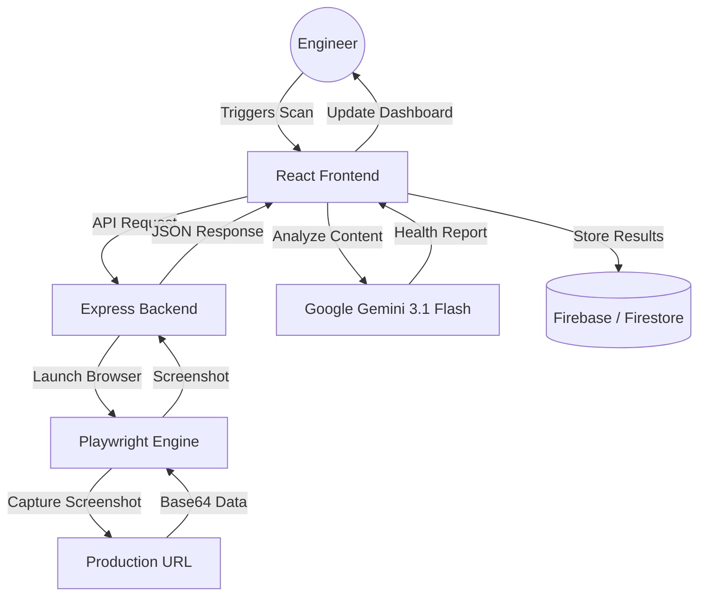
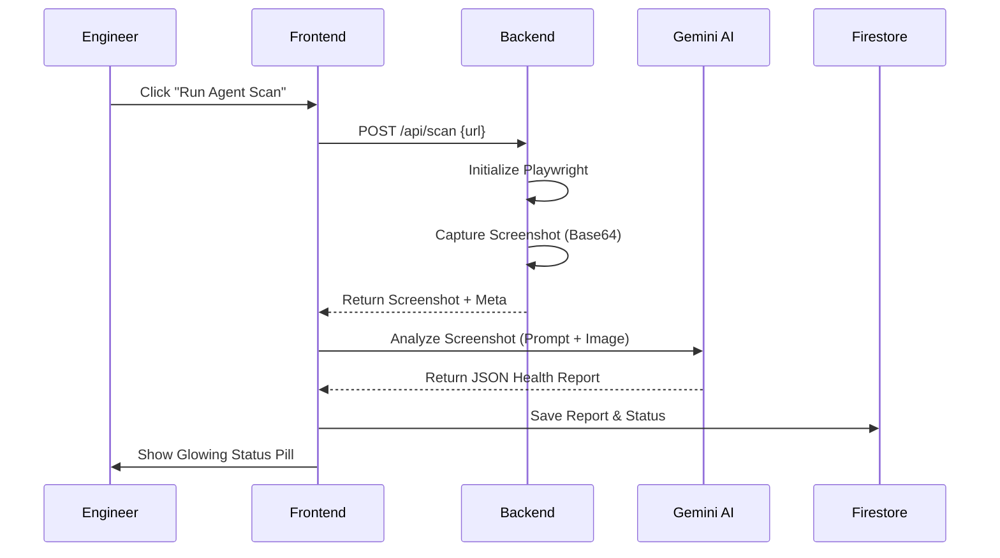

#  Dev-Pulse
### **Autonomous SRE Dashboard for Real-Time Visual Reliability**

[](https://github.com/sablekunal/Dev-Pulse)
[](https://github.com/sablekunal/Dev-Pulse)
[](https://github.com/sablekunal/Dev-Pulse)

Dev-Pulse is an AI-native Site Reliability Engineering (SRE) platform designed for proactive visual monitoring. Unlike traditional logging tools that track server-side metrics, Dev-Pulse uses a headless browser "agent" to see exactly what your users see—catching UI regressions, layout breakages, and silent failures in real-time before your users do.

https://github.com/user-attachments/assets/bf9f8bae-74a1-4eb1-85e5-66dda14b4c82

---

## 🏗️ System Architecture

The following diagram illustrates how Dev-Pulse orchestrates browser automation, AI analysis, and persistent storage.



---

## 🛰️ Core Features

### 1. Autonomous Visual Agent
*   **Playwright-Powered Engine**: A headless Chromium backend that navigates to production URLs to capture high-fidelity DOM screenshots.
*   **AI Regression Analysis**: Integrated with **Google Gemini 3.1 Flash**. The AI analyzes screenshots for:
    *   Visible error messages (404, 500, etc.).
    *   Layout regressions (overlapping elements, broken CSS).
    *   Resource failures (massive whitespace or missing components).
*   **Structured Reporting**: Returns AI-generated health reports with status levels (Healthy, Critical), confidence scores, and recommended fixes.

### 2. Operational Control Center (UI/UX)
*   **Immersive "Mission Control" Theme**: A sleek, dark-mode technical interface featuring glass morphism, grid-based telemetry, and glowing status indicators.
*   **Fleet Management**: Add and monitor multiple "Nodes" (production endpoints) from a unified grid.
*   **Manual & Automated Triggers**: "Run Agent Scan" initiates the visual capture and AI analysis loop on demand.
*   **Historical Reporting**: Scans are stored and displayed with timestamps and historical status data.

### 3. Enterprise Infrastructure
*   **Full-Stack Architecture**: Built on **Express (Node.js)** and **React (Vite)** to handle both heavy browser automation and snappy UI interactions.
*   **Firebase Backend**:
    *   **Firestore**: Scalable NoSQL storage for projects and scan history.
    *   **Google Authentication**: Secure, popup-based login to ensure system access is restricted to authorized engineers.

---

## 🔄 Scan Execution Flow



---

## 🛠️ Tech Stack

| Layer | Technology | Purpose |
| :--- | :--- | :--- |
| **Frontend** | React 19 | Component Architecture |
| **UI Styling** | Tailwind CSS 4 | Glassmorphism & Layout |
| **Animations** | Framer Motion | Interface Transitions |
| **Backend** | Express.js | API Orchestration |
| **Automation** | Playwright | Headless Chromium Capture |
| **AI Engine** | Google Gemini API | Visual Regression Analysis |
| **Database** | Firestore | NoSQL Persistence |
| **Auth** | Firebase Auth | Google SSO Integration |

---

## 🚀 Getting Started

### Prerequisites
*   **Node.js**: Version 20 or higher.
*   **Gemini API Key**: Obtain from [Google AI Studio](https://aistudio.google.com/).
*   **Firebase Project**: Setup Firestore and Google Authentication.

### Installation

1. **Clone the repository**
   ```bash
   git clone https://github.com/sablekunal/Dev-Pulse.git
   cd Dev-Pulse
   ```

2. **Install dependencies**
   ```bash
   npm install
   npx playwright install chromium
   ```

3. **Configure Environment Variables**
   Create a `.env` file in the root directory:
   ```env
   GEMINI_API_KEY="your_api_key_here"
   APP_URL="http://localhost:3000"
   ```

4. **Run the application**
   ```bash
   npm run dev
   ```

---

## 📖 Usage Manual

1.  **Initialize Session**: Click "Initialize Session" on the landing page to log in via Google.
2.  **Register Node**: Use "New Node" to provide a name and production URL for monitoring.
3.  **Trigger Scan**: Click the "Scan" icon on any node card.
4.  **Analyze Results**: Review the glowing status pill and transition back to healthy once fixes are deployed.
5.  **Remediation**: Use the "Remediation Workspace" to see AI-suggested code patches for UI failures.

---

## 📜 Metadata

*   **Name**: Dev-Pulse
*   **Protocol**: SRE-CORE-01
*   **Environment**: Production // Mission-Critical
*   **Developed for**: Google AI Studio

---

>*DEV-PULSE ARCHITECTURE // SRE-CORE-01 Protocol*
